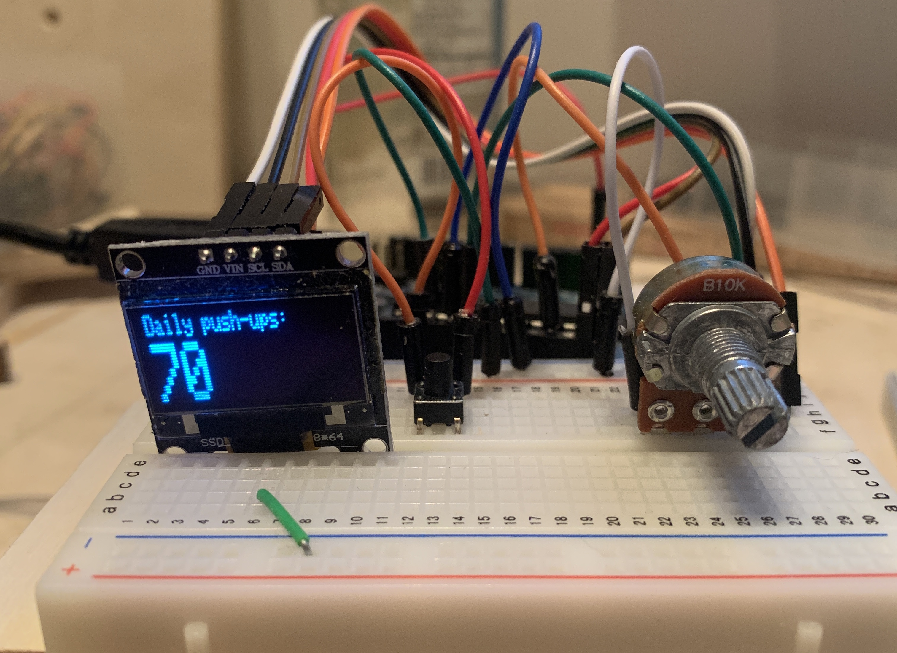
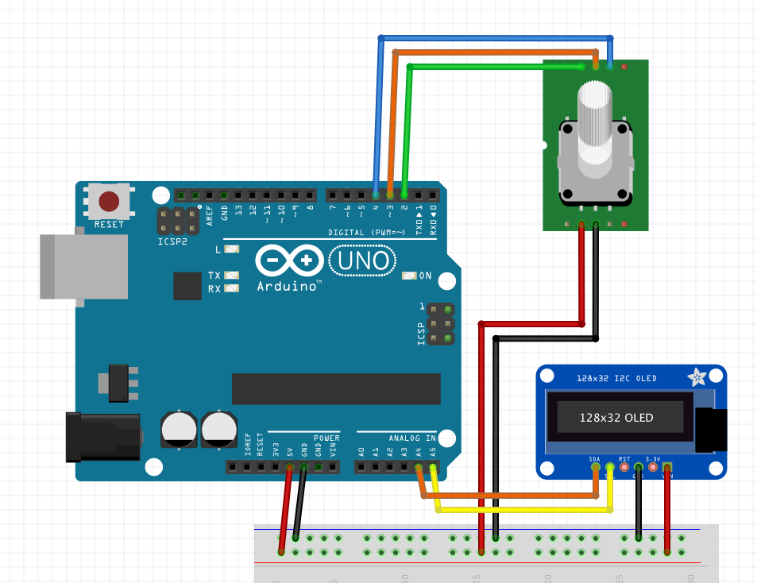

# Mini-OLED Workout display
A small wall-mounted display with input to set and display excersize repetitions per day.

## Setup
This project depends on the arduino library `Adafruit SSD1306` and its dependencies.

From Arduino IDE library can be added by navigating to the following menu item: Sketch -> Include Library -> Manage Libaries.  
From here search for `Adafruit SSD1306`, this should prompt to also download `Adafruit GFX Library` and `Adafruit BusIO`; select All or install them manually.

# Features

## Hardware
- OLED screen: Displays the current number of repetitions.
- Potentiometer: Setting value to display.
- Button: Change from repetition view mode to a menu view using `digitalPinToInterrupt`.

## Software
 - Timeout: Any pot input has 1 second of timeout since last value change. After timeout runs out the value locks and a value of ± 2 must be read to enable inputs and reset the cooldown.
 - Menu: Interrupt button toggles menu and view mode, TODO everything else.

## Graphics
Ideas for what to display on the screen.

 - Large print of count.
 - This weeks avg.
 - Animations on save ?
 - View history
   - Scroll back needs to fetch & maybe cache results.
   - Loading animation.

## Wiring diagram

